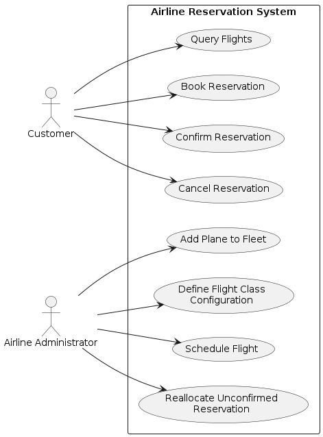
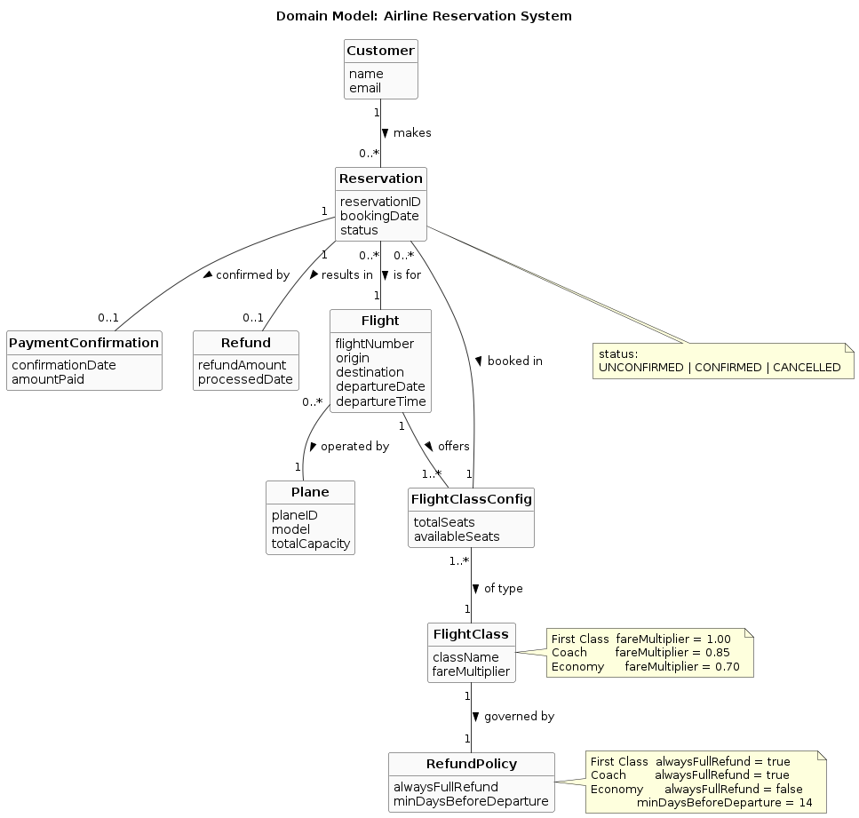

# COMP 371 Airline Reservation System

This repository contains the Winter 2026 group project for COMP 371 (Object Oriented Modeling and Design).
The goal is to design and implement an airline reservation system by following the Unified Process and applying UML-driven object-oriented design.

## Overview

The system supports two major service groups:

1. Provisioning services for the airline:
- Add planes to the fleet
- Define flight classes
- Schedule flights

2. Customer-facing services:
- Query flights using conditions (origin, destination, date, class)
- Book reservations
- Confirm reservations after payment
- Cancel reservations and process refunds

## Ticket and Refund Rules

| Ticket Type | Fare Percentage | Refundability |
| --- | --- | --- |
| First Class | 100% | Full refund on cancellation |
| Coach | 85% | Full refund on cancellation |
| Economy | 70% | Full refund only when canceled at least 14 days before departure |

Additional reservation rule:
- A reservation is considered confirmed only after payment.
- Unconfirmed reservations may be reallocated when seats become scarce.

## Project Deliverables

The project deliverables:

1. Use cases, use case diagram, and complementary requirement documents
2. Domain model diagram
3. UML interaction diagrams (SSD/sequence/activity)
4. Operation contracts
5. Design class diagram (DCD) with applied patterns
6. Java implementation (UI + persistence + business logic)
7. Implementation report with workflow explanation and labeled screenshots

## Planned Tech Stack

- Language: Java
- UI: Swing
- Persistence: File-based storage
- Design Approach: Layered architecture (UI, application services, domain, persistence)

## Planned Repository Layout

```text
COMP371/
	README.md
	docs/        # use cases, specs, contracts, report draft
	diagrams/    # UML and design artifacts
	src/         # Java source code
	data/        # persisted files and seed data
```

## Current Status

Planning and requirements phase.

## Team

- Member 1: Bhupinder Singh Gill
- Member 2: Navpreet Singh
- Member 3: Prabhjeet Kaur

## Team Responsibilities

- Prabhjeet Kaur: Use cases, use case diagram, and complementary requirement documents.
- Bhupinder Singh Gill: Diagrams and code implementation.
- Navpreet Singh: Assist with code implementation and later testing with screenshots to ensure everything is working fine.

---

# Phases:

## Phase 1 - Inception: capture vision, glossary, supplementary requirements, scope boundaries, and stakeholder goals for the airline reservation system. This establishes the problem definition and blocks all later analysis work.

During Inception, we will focus on understanding the problem domain, defining the system's vision and scope, and identifying the key stakeholders and their goals. We will also create a glossary of terms to ensure a shared understanding of the domain vocabulary. This phase is critical for setting a solid foundation for all subsequent phases of the project.

The main deliverables for this phase will include:
- A clear vision statement for the airline reservation system.
- A glossary of domain terms.
- A list of supplementary requirements that capture non-functional requirements and business rules.
- A use case inventory that identifies all the interactions between actors and the system.

The output files can be found in the `docs/` directory, including `vision.md`, `glossary.md`, `supplementary_requirements.md`, and `use_cases.md`. These documents will be referenced throughout the project to ensure consistency and alignment with the defined vision and requirements.

## Phase 2 - Elaboration: build the conceptual domain model, derive system operations from SSDs, write operation contracts for the risky flows, and assign responsibilities with GRASP. This establishes the core design and blocks all later implementation work.

During Elaboration, we will focus on creating a detailed conceptual domain model that captures the key entities and their relationships in the airline reservation system. We will also derive system operations from the System Sequence Diagrams (SSDs) for the architecturally significant use cases and write operation contracts for the most complex and rule-heavy flows, such as booking, confirming, and canceling reservations.

The following diagrams have been created and can be found in the `diagrams/` directory:

**Use Case Diagram** — shows all actors (Customer, Airline Administrator) and their interactions with the system across provisioning and reservation services.



**Domain Model** — shows the conceptual entities, their key attributes, and associations derived from the use cases and glossary. No design or implementation details are included at this stage.




## Phase 3 - Construction: design and implement in thin vertical slices, starting with provisioning capabilities and then customer-facing services. This builds the system iteratively while maintaining alignment with the design.

## Phase 4 - Transition: integrate the persistence layer, assemble the UI, and prepare for final verification and report assembly. This finalizes the system and prepares for delivery.